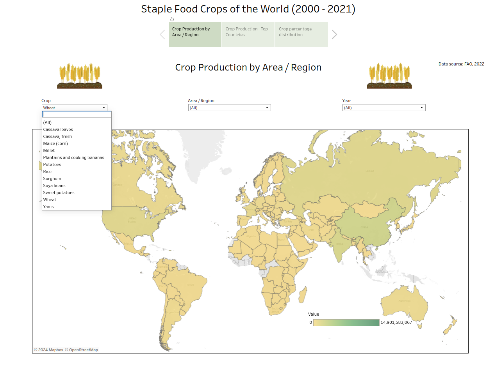
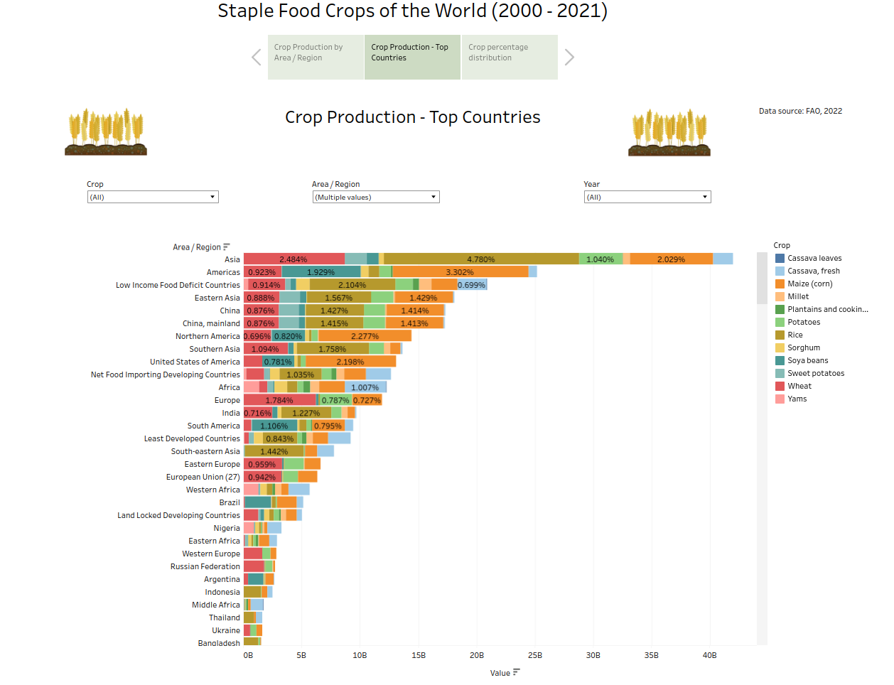
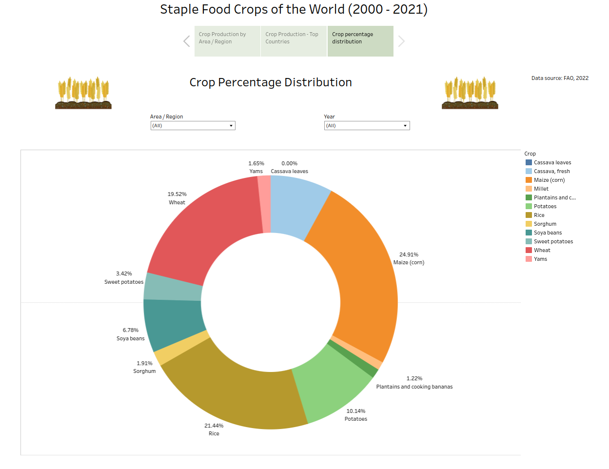
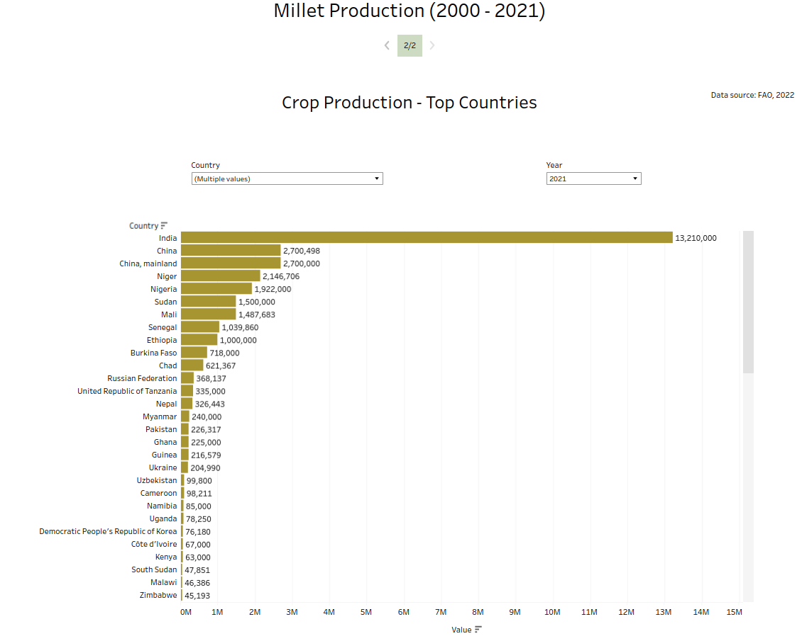
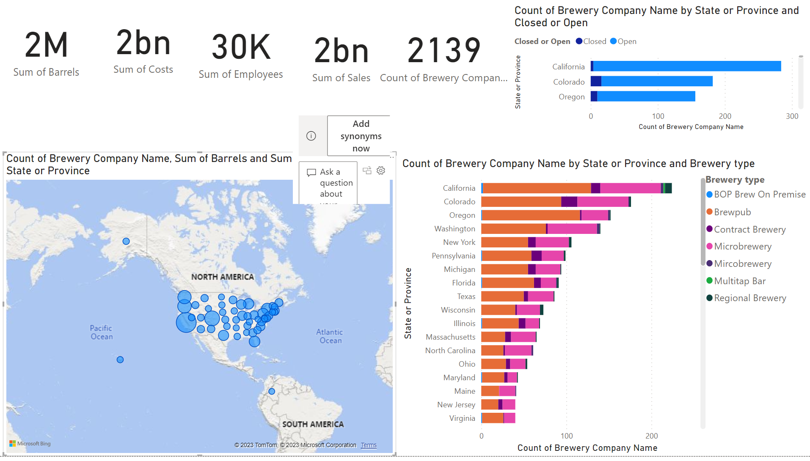
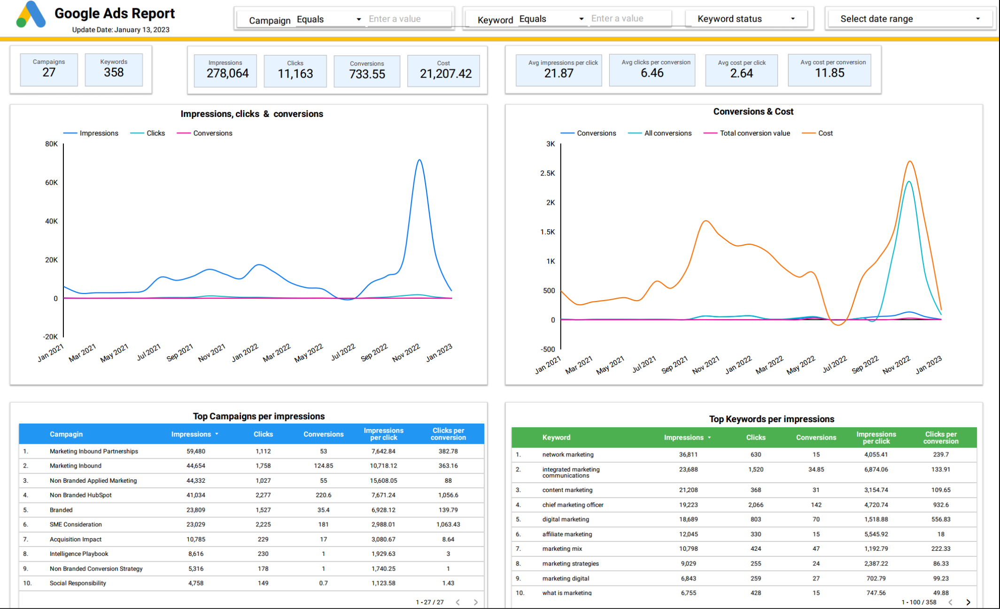

# Data Analysis Portfolio Projects

## Streamlit - Health-Related Sustainable Development Goals Dashboard

* **Date of creation:** January 28, 2026
* **Data Source:** Data is fetched in real-time from the [WHO Global Health Observatory OData API](https://www.who.int/data/gho/info/gho-odata-api).
* **GitHub Repository:** [Link](https://github.com/rosa-lpz/streamlit-health-dashboard)
* **Demo:** https://health-related-sustainable-development-goals-dashboard.streamlit.app/
* **Technologies Used**
  - **Streamlit** - Web application framework
  - **Pandas** - Data manipulation
  - **Plotly** - Interactive visualizations
  - **Requests** - API calls

## Python Plotly - Remote Work & Mental Health (EDA)

* Date of creation: November 13, 2024
* Dataset in Kaggle: [Link](https://www.kaggle.com/datasets/waqi786/remote-work-and-mental-health/data)
* Notebook in GitHub: [Link](Python%20Plotly%20-%20Remote%20Work%20%26%20Mental%20Health/Impact_of_Remote_Work_on_Mental_Health_(Plotly).ipynb)
* Notebook in Google Colaboratory: [Link](https://drive.google.com/file/d/1I3Ka4_PBDKJE1NvSGAsiZEFlVq2DX_GW/view?usp=sharing)
* Notebook in Google Colaboratory (PySpark): [Link](https://colab.research.google.com/drive/1b3Mpo7T6vpzSbbzsrxGdbA41PeelFRzX?usp=sharing)

## Tableau - Staple Food Crops of the World (2000 - 2021)

* Date of creation: August 30, 2023
* Data Source: FAO, 2022 
* Tableau Public: [Link](https://public.tableau.com/app/profile/rosalopez/viz/StapleFoodCropsoftheWorld2000-2021/StapleFoodCropsoftheWorld2000-2021)

## Tableau - E-Commerce Revenue UK retailer

* Date of creation: Aug 30, 2023
* Dataset in Kaggle: [Link](https://www.kaggle.com/datasets/carrie1/ecommerce-data) 
* Tableau Public: [Link](https://public.tableau.com/views/E-Commerce-UK/Story1?:language=en-US&:sid=&:redirect=auth&:display_count=n&:origin=viz_share_link)

------

## Python - Water potability Exploratory Data Analysis (EDA)

* Date of creation: July 17, 2023
* Dataset in Kaggle: [Link](https://www.kaggle.com/datasets/adityakadiwal/water-potability)
* Notebook in Google Colaborary: [Link](https://colab.research.google.com/drive/191QOQFcczyvk2RzzK7ZMlCcHXoayLX_c?usp=sharing)

## Tableau - Millet Production (2000 - 2021)

* Date of creation: May 4, 2023
* Data Source: FAO, 2022 
* Tableau Public: [Link](https://public.tableau.com/views/Millet_FAO/StapleFoodCropsoftheWorld2000-2021?:language=en-US&:sid=&:redirect=auth&:display_count=n&:origin=viz_share_link)

## 

## SQL & Power BI - Breweries

* Date of creation: April 7, 2023
* Data Source: [Link](https://github.com/rosa-lpz/Data-Analysis-Portfolio/tree/23da5d13ff25e470df8633ac00fea07d05341c30/SQL%20%26%20PowerBI%20-%20Breweries/Data)
* Data processing (SQL script): [Link](https://github.com/rosa-lpz/Data-Analysis-Portfolio/blob/23da5d13ff25e470df8633ac00fea07d05341c30/SQL%20%26%20PowerBI%20-%20Breweries/SQL_breweries.sql)

## Google Data Studio - Google Ads

* Date of creation: January 13, 2023

